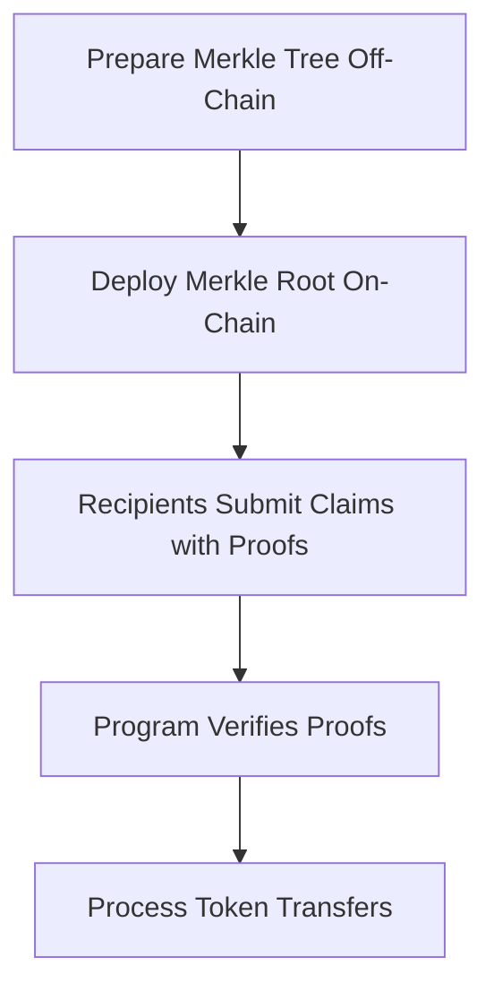

# Solana Airdrop Program with Merkle Tree Proofs

This project is a Solana program designed to perform efficient airdrops by leveraging Merkle tree proofs.

## How It Works



## Installation

1. Clone the repository:
```bash
git clone https://github.com/tsukigatari/merkle-airdrop
cd merkle-airdrop
```

2. Install dependencies:
```bash
yarn
```

3. Build the project:
```bash
anchor build
```

4. Run Tests:
```bash
anchor test
```

5. Deploy the program to the Solana blockchain:
```bash
anchor deploy
```

## License

This project is licensed under the [MIT License](https://opensource.org/licenses/MIT).
